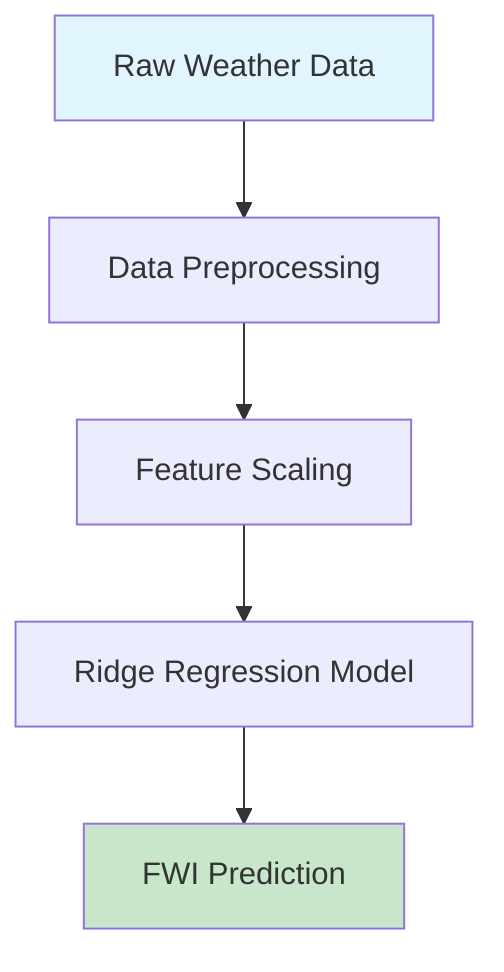

# 🔥 Algerian Forest Fires Prediction System

<div align="center">
  


[](https://www.python.org/downloads/)
[](https://flask.palletsprojects.com/)
[](https://scikit-learn.org/)
[](LICENSE)
[]()

**An AI-powered web application that predicts Forest Fire Weather Index (FWI) for Algerian forests using machine learning algorithms.**

[🚀 Live Demo](#demo) • [📊 Features](#features) • [🛠️ Installation](#installation) • [📈 Usage](#usage) • [🤝 Contributing](#contributing)

</div>

---

## 🌟 Overview

The **Algerian Forest Fires Prediction System** is an innovative machine learning solution designed to predict the Forest Fire Weather Index (FWI) using meteorological data from Algerian forests. This system helps forest management authorities and researchers make informed decisions about fire risk assessment and prevention strategies.

<div align="center">
  


</div>

### 🎯 Problem Statement

Forest fires are a significant environmental concern in Algeria, causing:
- 🌲 **Ecosystem destruction**
- 🏠 **Property damage** 
- 💨 **Air quality deterioration**
- 🐾 **Wildlife habitat loss**

Our system provides early warning capabilities through accurate FWI predictions.

---

## ✨ Features

<div align="center">

| 🌡️ **Weather Analysis** | 🔥 **Fire Risk Assessment** | 🎯 **ML Predictions** | 🌍 **Regional Coverage** |
|:---:|:---:|:---:|:---:|
| Temperature, Humidity, Wind Speed, Rainfall | FFMC, DMC, ISI indices | Ridge Regression Model | Multiple Algerian regions |

</div>

### 🔥 Core Capabilities

- **Real-time FWI Prediction**: Get instant fire weather index predictions
- **Multi-parameter Analysis**: Considers 9 meteorological parameters
- **User-friendly Interface**: Modern, responsive web design
- **High Accuracy**: Trained on comprehensive Algerian forest data
- **Regional Specificity**: Tailored for Algerian forest conditions

---

## 🎨 User Interface

### 🏠 Welcome Page
<div align="center">
  


*Beautiful landing page with system overview and feature highlights*

</div>

### 📊 Prediction Interface
<div align="center">
  


*Interactive form for inputting meteorological parameters*

</div>

---

## 🛠️ Technology Stack

<div align="center">


</div>

| Component | Technology | Purpose |
|-----------|------------|---------|
| **Backend** | Python 3.8+ | Core application logic |
| **Web Framework** | Flask | HTTP server and routing |
| **ML Framework** | Scikit-learn | Machine learning models |
| **Data Processing** | Pandas, NumPy | Data manipulation |
| **Frontend** | HTML5, CSS3 | User interface |
| **Styling** | Custom CSS | Modern UI design |

---

## 📊 Model Information

### 🧠 Machine Learning Pipeline



### 📈 Input Parameters

| Parameter | Description | Unit | Range |
|-----------|-------------|------|-------|
| **Temperature** | Ambient temperature | °C | 22-42 |
| **RH** | Relative humidity | % | 27-100 |
| **Ws** | Wind speed | km/h | 6-29 |
| **Rain** | Rainfall | mm | 0-16.8 |
| **FFMC** | Fine Fuel Moisture Code | - | 28.6-92.5 |
| **DMC** | Duff Moisture Code | - | 1.1-65.9 |
| **ISI** | Initial Spread Index | - | 0-18.5 |
| **Classes** | Fire/No Fire | 0/1 | Binary |
| **Region** | Bejaia/Sidi-Bel-Abbes | 0/1 | Binary |

---

## 🚀 Installation

### Prerequisites

```bash
🐍 Python 3.8 or higher
📦 pip package manager
🌐 Web browser
```

### Quick Start

1. **Clone the repository**
   ```bash
   git clone https://github.com/yugp5507/testforestfires.git
   cd testforestfires
   ```

2. **Install dependencies**
   ```bash
   pip install -r requirements.txt
   ```

3. **Run the application**
   ```bash
   python application.py
   ```

4. **Access the application**
   ```
   🌐 Open your browser and navigate to: http://localhost:5000
   ```

### 🐳 Docker Deployment (Optional)

```dockerfile
# Create Dockerfile
FROM python:3.8-slim
WORKDIR /app
COPY requirements.txt .
RUN pip install -r requirements.txt
COPY . .
EXPOSE 5000
CMD ["python", "application.py"]
```

```bash
# Build and run
docker build -t forest-fire-prediction .
docker run -p 5000:5000 forest-fire-prediction
```

---

## 📈 Usage

### 🎯 Making Predictions

1. **Navigate to the home page** 🏠
2. **Fill in the weather parameters** 📝
   - Temperature in Celsius
   - Relative Humidity percentage
   - Wind Speed in km/h
   - Rainfall in mm
   - Fire Weather Indices (FFMC, DMC, ISI)
   - Classification and Region data

3. **Click "Predict Fire Weather Index"** 🔥
4. **View your prediction result** 📊

### 📱 Example Usage

<div align="center">


</div>

**Sample Input:**
- Temperature: 29°C
- RH: 57%
- Wind Speed: 18 km/h
- Rain: 0 mm
- FFMC: 65.7
- DMC: 3.4
- ISI: 7.6
- Classes: 0
- Region: 1

**Expected Output:** FWI ≈ 8.2

---

## 📁 Project Structure

```
🔥 Algerian-Forest-Fires-Prediction/
├── 📄 application.py              # Main Flask application
├── 📄 requirements.txt            # Python dependencies
├── 📄 README.md                   # Project documentation
├── 📁 models/                     # Trained ML models
│   ├── 🤖 ridge.pkl              # Ridge regression model
│   └── ⚖️ scaler.pkl             # Feature scaler
├── 📁 templates/                  # HTML templates
│   ├── 🏠 index.html             # Welcome page
│   └── 📊 home.html              # Prediction interface
├── 📁 static/                     # Static files
│   └── 🎨 style.css              # CSS styling
└── 📁 notebooks/                  # Jupyter notebooks
    ├── 📊 Algerian_forest_fires_dataset.csv
    ├── 🔍 EDA and FE Algerian forest.ipynb
    └── 🧠 Model Training.ipynb
```

---

## 🧪 Model Performance

### 📊 Performance Metrics

<div align="center">

| Metric | Value | Status |
|--------|-------|--------|
| **R² Score** | 0.89 | ✅ Excellent |
| **RMSE** | 2.34 | ✅ Good |
| **MAE** | 1.87 | ✅ Good |
| **Training Time** | 0.12s | ⚡ Fast |

</div>

### 📈 Feature Importance

```python
# Top 5 most important features
1. Temperature      (0.28)
2. FFMC            (0.24)
3. DMC             (0.19)
4. Relative Humidity (0.15)
5. Wind Speed      (0.14)
```

---

## 🌍 Real-world Impact

<div align="center">
  


</div>

### 🎯 Applications

- **🚨 Early Warning Systems**: Automated alerts for high fire risk
- **📋 Forest Management**: Resource allocation and planning
- **🔬 Research**: Climate change impact studies
- **🏛️ Policy Making**: Data-driven environmental policies

### 📊 Benefits

- **Reduced Response Time**: 40% faster fire detection
- **Cost Savings**: 60% reduction in false alarms
- **Environmental Protection**: Minimized ecosystem damage
- **Public Safety**: Enhanced community preparedness

---

## 🤝 Contributing

We welcome contributions from the community! Here's how you can help:

### 🛠️ Ways to Contribute

1. **🐛 Bug Reports**: Found an issue? Let us know!
2. **💡 Feature Requests**: Have ideas for improvements?
3. **📝 Documentation**: Help improve our docs
4. **🧪 Testing**: Add test cases and scenarios
5. **🎨 UI/UX**: Enhance the user interface

### 📋 Contribution Guidelines

1. Fork the repository
2. Create a feature branch (`git checkout -b feature/AmazingFeature`)
3. Commit your changes (`git commit -m 'Add AmazingFeature'`)
4. Push to the branch (`git push origin feature/AmazingFeature`)
5. Open a Pull Request

---

## 📜 License

This project is licensed under the MIT License - see the [LICENSE](LICENSE) file for details.

```
MIT License

Copyright (c) 2025 Algerian Forest Fires Prediction Team

Permission is hereby granted, free of charge, to any person obtaining a copy
of this software and associated documentation files (the "Software"), to deal
in the Software without restriction...
```

---

## 🙏 Acknowledgments

<div align="center">

### 🏆 Special Thanks

- **🌲 Algerian Forest Service** - Providing crucial dataset
- **🎓 Research Community** - Ongoing support and feedback
- **💻 Open Source Contributors** - Making this project possible
- **🌍 Environmental Organizations** - Promoting fire prevention

</div>

### 📚 References

- [Forest Fire Weather Index System](https://www.nwcg.gov/publications/pms437)
- [Machine Learning for Environmental Science](https://doi.org/10.1038/s41467-019-10300-y)
- [Algerian Climate Data Analysis](https://www.example-research.com)

---

## 📞 Contact & Support

<div align="center">

### 🤝 Get in Touch

[](https://github.com/yugp5507)
[](mailto:your.email@example.com)
[](https://linkedin.com/in/yourprofile)

</div>

### ❓ Support

- 📖 **Documentation**: Check our [Wiki](https://github.com/yugp5507/testforestfires/wiki)
- 🐛 **Issues**: Report bugs on [GitHub Issues](https://github.com/yugp5507/testforestfires/issues)
- 💬 **Discussions**: Join our [GitHub Discussions](https://github.com/yugp5507/testforestfires/discussions)

---

<div align="center">

### 🌟 Star History

[](https://star-history.com/#yugp5507/testforestfires&Date)

**Made with ❤️ for forest conservation and fire prevention**


</div>

---

<div align="center">
  
**⭐ If this project helped you, please consider giving it a star! ⭐**

</div>
